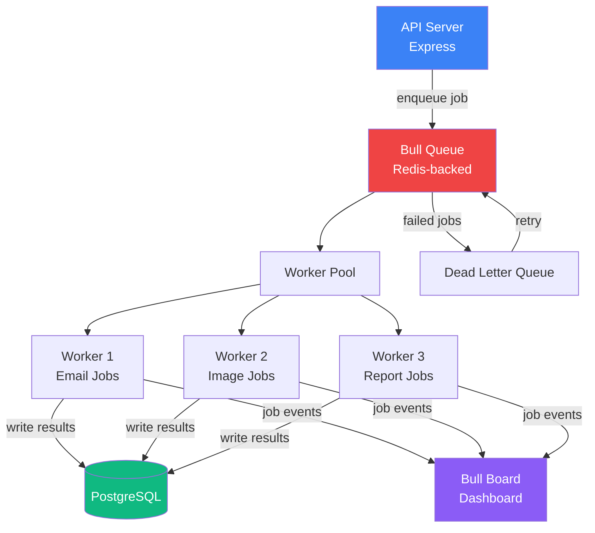

# Job Queue & Workflow Orchestration Engine

A production-grade job queue system built on Redis and Bull that handles distributed task scheduling, priority queues, retries with exponential backoff, and multi-step workflow orchestration across worker processes.

## Architecture



## How It Works

1. **API layer** accepts job submissions and pushes them onto named Bull queues backed by Redis
2. **Worker processes** pull jobs concurrently, each specializing in a job type (email, image processing, report generation)
3. **Failed jobs** are retried with exponential backoff; after max attempts they land in a dead-letter queue for inspection
4. **Workflows** chain multiple jobs — completing one job triggers the next in a defined sequence
5. **Bull Board** provides a real-time UI to monitor queues, inspect payloads, and manually retry jobs

## Tech Stack

| Layer | Technology |
|-------|-----------|
| Queue | Bull + Redis |
| API | Node.js + Express |
| Workers | Node.js child processes |
| Database | PostgreSQL |
| Dashboard | Bull Board |
| Scheduling | Bull cron-style repeatable jobs |

## Project Structure

```
job-queue-engine/
├── src/
│   ├── api/          # Express routes for job submission
│   ├── queues/       # Bull queue definitions (email, image, report)
│   ├── workers/      # Worker processors for each queue
│   ├── workflows/    # Multi-step job chain definitions
│   └── db/           # PostgreSQL schema + queries
├── docker-compose.yml
└── README.md
```

## Key Features

- Priority queues — critical jobs skip the line
- Exponential backoff retries (configurable max attempts)
- Workflow chaining — job B starts only after job A succeeds
- Cron-style scheduled jobs (repeatable)
- Real-time Bull Board dashboard
- Graceful shutdown — workers drain current jobs before exiting
